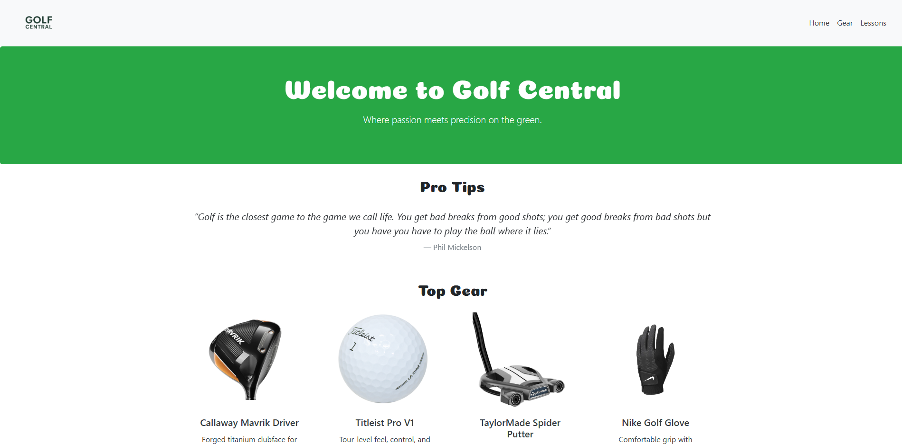

# Golf Central

Golf Central is a simple, responsive website that highlights popular golf gear and offers helpful tips for players. It was built using **HTML**, **CSS**, and **Bootstrap 4.4**.

## Features

- Navigation bar with logo and page links
- Hero section with a welcome message
- Gear section with a multi-item layout
- Tips section for golf advice
- Mobile-friendly design

## Tools & Technologies

- HTML5 & CSS3
- Bootstrap 4.4 (for layout and responsiveness)
- Google Fonts (for custom typography)
- Custom images and styles

## How to View

1. Open `index.html` in a web browser.
2. Make sure the `images/` folder and `styles.css` are in the same directory.
3. The Pro Tip Section has a control that is invisible you need to click to the left or right of the quote to change them.

## Project Purpose

This project was created as part of my front-end learning at **Atlas School**, focusing on responsive design and Bootstrap fundamentals.

